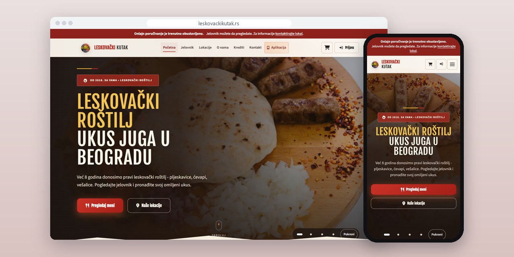
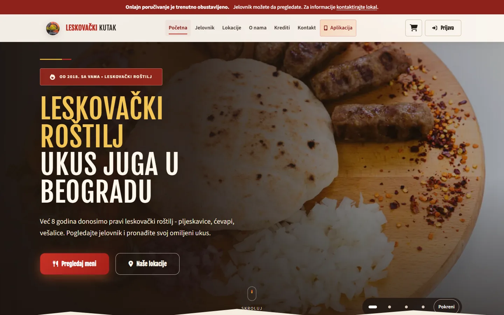
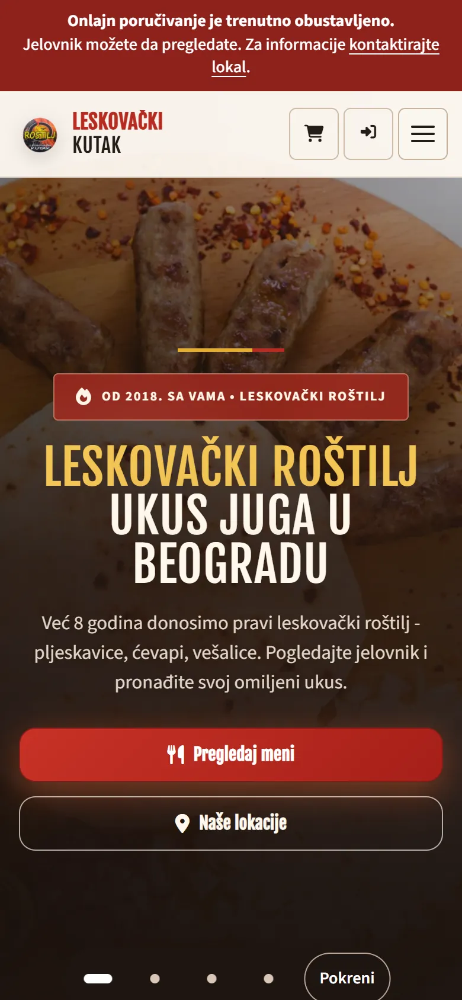
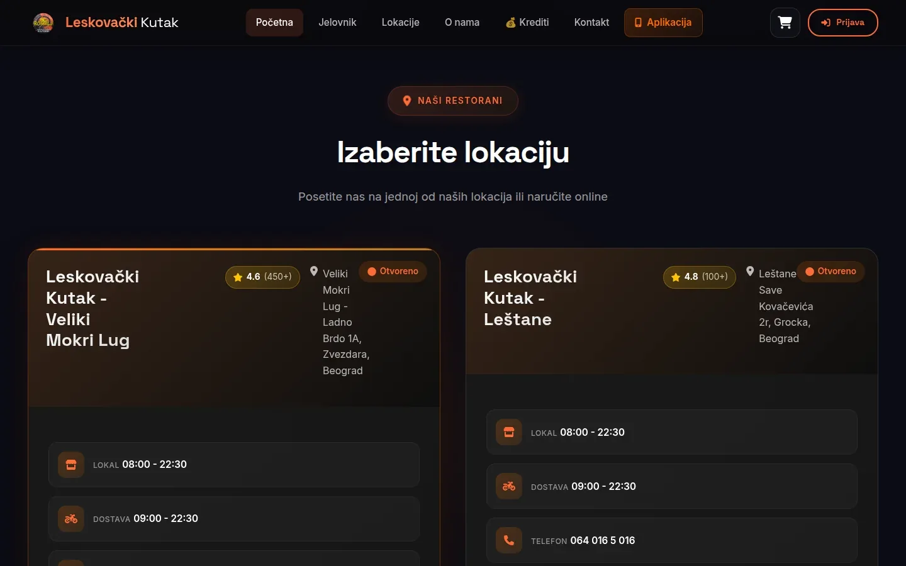
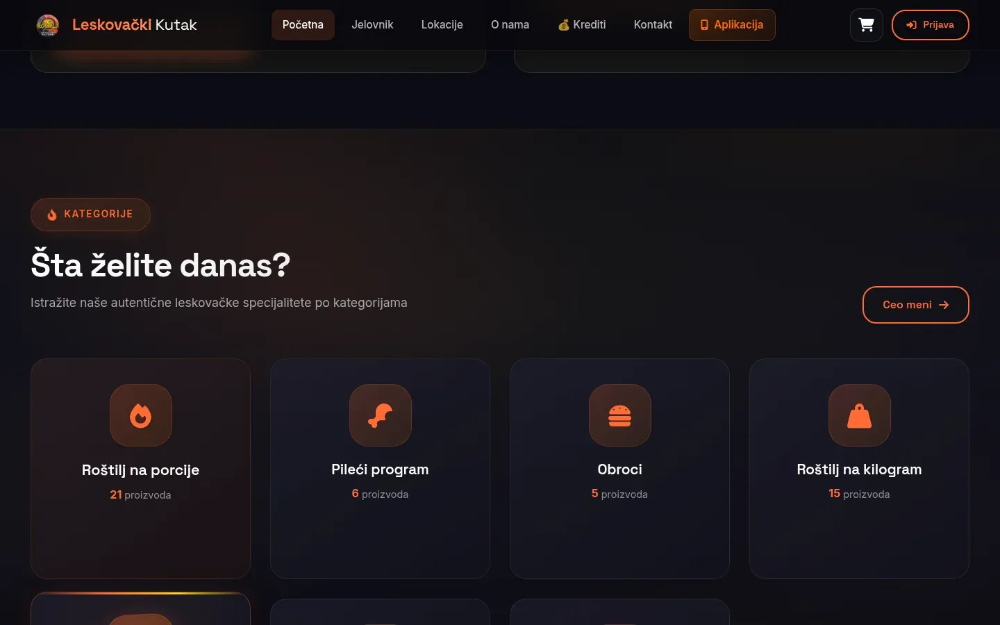

# Leskovački Kutak

Ordering platform for a Leskovac-style grill with two Belgrade locations: nearest kitchen by address, loyalty credits and an Android app.

**[leskovackikutak.rs](https://leskovackikutak.rs/)** · [Case study (in Serbian)](https://svilenkovic.com/radovi/leskovacki-kutak) · [App page](https://svilenkovic.com/en/aplikacija-leskovacki-kutak) · [Srpski](README.sr.md)

> [!NOTE]
> Client project. The source code belongs to the client and stays in a private repository. This page describes what I built and how.

<table>
  <tr><td><b>Client</b></td><td>Leskovački Kutak</td></tr>
  <tr><td><b>Industry</b></td><td>Leskovac-style grill restaurant with home delivery</td></tr>
  <tr><td><b>Location</b></td><td>Belgrade, Serbia</td></tr>
  <tr><td><b>Type</b></td><td>Ordering platform: website, apps and panels</td></tr>
  <tr><td><b>My role</b></td><td>Design, development, SEO, hosting and maintenance</td></tr>
  <tr><td><b>Stack</b></td><td>PHP 8.3, MariaDB, REST API, Server-Sent Events, PWA, Android TWA</td></tr>
</table>

## About the project

Leskovački Kutak is a grill with two locations in Belgrade, Veliki Mokri Lug and Leštane, each with its own hours, phone and part of the city. The owner wanted an ordering channel of his own, with no commission per order, where an order finds the right kitchen by itself and the menu is his to edit.

The address field autocompletes from a registry of 12,263 streets and 297,101 house numbers, and the closer kitchen is picked by distance. Browser coordinates are used when available; otherwise they come from the best matching street in the registry. If that fails too, the default location takes the order, so refusing location access never blocks anyone. The site, customer app, restaurant panel, courier app and admin all work on one MariaDB database through a shared REST API.

## What I built

- New orders pushed to the kitchen screen over Server-Sent Events, with an audible alert and printable tickets, and to the courier's phone once assigned
- Separate apps with their own logins for customers, locations, couriers and admin; a location sees only its own orders, a courier only what is assigned to them
- Loyalty credits with four tiers based on monthly spend, a referral code on every account and each credit booked as a transaction
- Search that treats ćevapi and cevapi the same, through generated, indexed columns in MariaDB and one folding function shared by PHP and JavaScript
- A PWA installed straight from the site, plus a signed Android package (TWA) verified with Digital Asset Links
- A sign-up check that runs before the insert and before any email goes out, on both registration paths, after 2,230 of 2,256 accounts turned out to be fake

## Results

| | Performance | Accessibility | Best practices | SEO |
| :-- | :-: | :-: | :-: | :-: |
| Mobile | 98 | 100 | 100 | 100 |
| Desktop | 100 | 100 | 100 | 100 |

PageSpeed Insights, lab test of the live site, September 2026. Security headers: 6 of 6. HTML validator: no errors. axe accessibility check: no violations. Structured data: `Restaurant`.

## Screenshots

<table>
  <tr>
    <td width="68%" valign="top"></td>
    <td width="32%" valign="top"></td>
  </tr>
</table>

Choose a location: Veliki Mokri Lug and Leštane, each with its own opening hours

The "Šta želite danas" (What would you like today) section: menu categories with item counts

---

Built by [D. Svilenković](https://svilenkovic.com).
